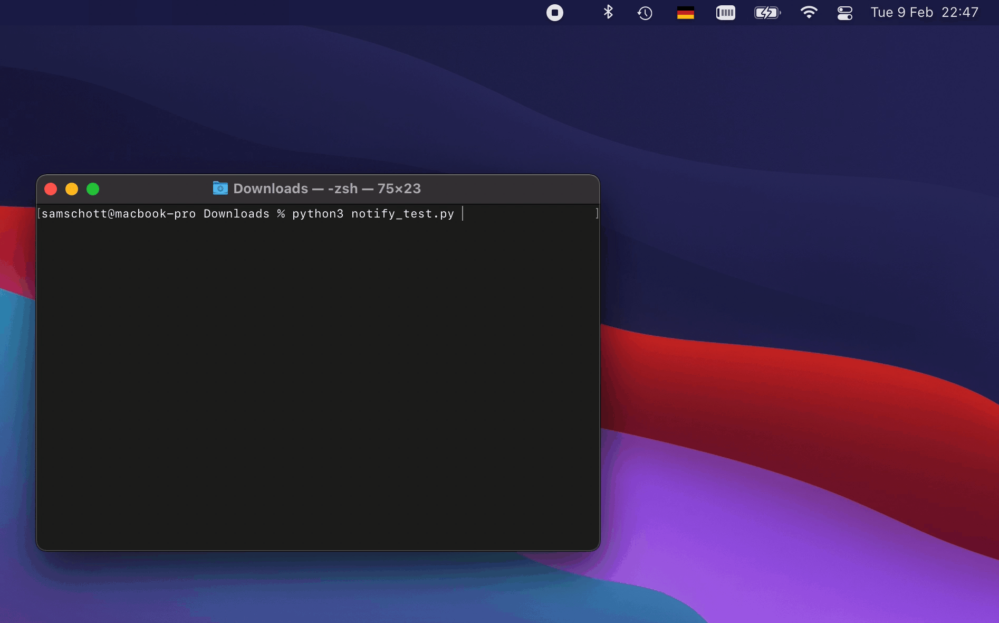

[](https://pypi.org/project/desktop-notifier/)
[](https://pypi.org/pypi/desktop-notifier/)
[](https://desktop-notifier.readthedocs.io/en/latest/?badge=latest)

# Desktop Notifier

`desktop-notifier`  is a Python library for cross-platform desktop notifications.
Currently supported platforms are:

* Linux via the dbus service org.freedesktop.Notifications
* macOS and iOS via the Notification Center framework
* Windows via the WinRT / Python bridge (exprimental).



## Features

Where supported by the native platform APIs:

* Clickable notifications
* Multiple action buttons
* A single reply field (e.g., for chat notifications)
* Asyncio integration: the main API consists of async methods and a running event loop
  is required to respond to user interactions with a notification
* Notification sounds
* Notification threads (e.g., for different conversations)
* Limit maximum number of notifications shown in the notification center
* Pure Python dependencies only, no extension modules

## Installation

From PyPI:

```
pip3 install -U desktop-notifier
```

## Usage

The main API consists of asynchronous methods which need to be awaited. Basic usage only
requires the user to specify a notification title and message. For instance:

```Python
import asyncio
from desktop_notifier import DesktopNotifier

notify = DesktopNotifier()

async def main():
    n = await notify.send(title="Hello world!", message="Sent from Python")
    
    await asyncio.sleep(5)  # wait a bit before clearing notification

    await notify.clear(n)  # removes the notification
    await notify.clear_all()  # removes all notifications for this app

asyncio.run(main())
```

For convenience, the is also a synchronous method ``send_sync()`` to send notifications
which does not require a running asyncio loop:

```Python
notify.send_sync(title="Hello world!", message="Sent from Python")
```

By default, "Python" will be used as the app name for all notifications, but you can
manually specify an app name and icon in the ``DesktopNotifier`` constructor. Advanced
usage also allows setting different notification options such as urgency, buttons,
callbacks, etc. The following code will generate the notification shown in the gif at
the top of the page:

```Python
from desktop_notifier import DesktopNotifier, Urgency, Button, ReplyField

notify = DesktopNotifier()

async def main():
  await notify.send(
      title="Julius Caesar",
      message="Et tu, Brute?",
      urgency=Urgency.Critical,
      buttons=[
        Button(
          title="Mark as read",
          on_pressed=lambda: print("Marked as read")),
      ],
      reply_field=ReplyField(
        title="Reply",
        button_title="Send",
        on_replied=lambda text: print("Brutus replied:", text),
      ),
      on_clicked=lambda: print("Notification clicked"),
      on_dismissed=lambda: print("Notification dismissed"),
      sound=True,
  )
  

loop = asyncio.get_event_loop()
loop.create_task(main())
loop.run_forever()
```

Note that some platforms may not support all options. For instance, some Linux desktop
environments may not support notifications with buttons. macOS does not support
manually setting the app icon or name. Instead, both are always determined by the
application which uses the Library. This can be Python itself, when used interactively,
or a frozen app bundle when packaged with PyInstaller or similar solutions. Please refer
to the [Platform Support](https://desktop-notifier.readthedocs.io/en/latest/background/platform_support.html)
chapter of the documentation for more information on limitations for certain platforms.

Any options or configurations which are not supported by the platform will be silently
ignored. Please refer to the documentation on [Read the Docs](https://desktop-notifier.readthedocs.io)
for more information on platform support.

## Event loop integration

Using the asynchronous API is highly recommended to prevent multiple milliseconds of
blocking IO from DBus or Cocoa APIs. In addition, execution of callbacks requires a
running event loop. On Linux, an asyncio event loop will be sufficient but macOS
requires a running [CFRunLoop](https://developer.apple.com/documentation/corefoundation/cfrunloop-rht).

You can use [rubicon-objc](https://github.com/beeware/rubicon-objc) to integrate a Core
Foundation CFRunLoop with asyncio:

```Python
import asyncio
from rubicon.objc.eventloop import EventLoopPolicy

# Install the event loop policy
asyncio.set_event_loop_policy(EventLoopPolicy())

# Get an event loop, and run it!
loop = asyncio.get_event_loop()
loop.run_forever()
```

Desktop-notifier itself uses Rubicon Objective-C to interface with Cocoa APIs so you
will not be adding a new dependency. A full example integrating with the CFRunLoop is
given in [examples/eventloop.py](examples/eventloop.py). Please refer to the
[Rubicon Objective-C docs](https://rubicon-objc.readthedocs.io/en/latest/how-to/async.html)
for more information.

Likewise, you can integrate the asyncio event loop with a Gtk main loop on Gnome using
[gbulb](https://pypi.org/project/gbulb). This is not required for full functionality
but may be convenient when developing a Gtk app.

## Notes on macOS

On macOS 10.14 and higher, the implementation uses the `UNUserNotificationCenter`
instead of the deprecated `NSUserNotificationCenter`. `UNUserNotificationCenter`
restricts sending desktop notifications to signed executables. This means that
notifications will only work if the Python executable or bundled app has been signed.
Note that the installer from [python.org](https://python.org) provides a properly signed
Python framework but **homebrew does not** (manually signing the executable installed
by homebrew _should_ work as well).

If you freeze your code with PyInstaller or a similar package, you must sign the
resulting app bundle for notifications to work. An ad-hoc signature will be sufficient
but signing with an Apple developer certificate is recommended for distribution.

## Requirements

* macOS 10.13 or higher
* Linux desktop environment providing a dbus desktop notifications service

## Dependencies

* [dbus-next](https://github.com/altdesktop/python-dbus-next) on Linux
* [rubicon-objc](https://github.com/beeware/rubicon-objc) on macOS
